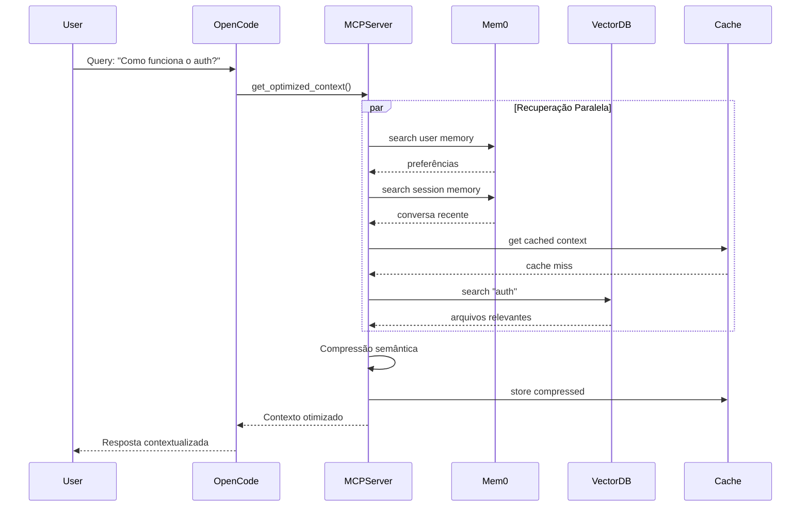

# Arquitetura Detalhada

## 1. Componentes Principais

### 1.1 MCP Server

O servidor MCP atua como ponte entre o OpenCode e o sistema de memória.

```typescript
// src/server.ts
import { McpServer } from '@modelcontextprotocol/sdk/server/mcp.js';

const server = new McpServer({
  name: 'rlm-mem0-server',
  version: '1.0.0'
});
```

**Tools expostas:**
- `get_optimized_context` - Recupera contexto com economia de tokens
- `store_memory` - Armazena memória no Mem0
- `search_code` - Busca código relevante
- `compress_context` - Comprime contexto existente

### 1.2 Camada de Memória Hierárquica

```
┌─────────────────────────────────────────────────────────────┐
│ NÍVEL 4: MEMÓRIA DE TRABALHO (Context Window)               │
│ • Tokens ativos no LLM                                      │
│ • ~8K-128K tokens (dependendo do modelo)                    │
└───────────────────────────┬─────────────────────────────────┘
                            │
┌───────────────────────────▼─────────────────────────────────┐
│ NÍVEL 3: MEMÓRIA DE SESSÃO (Mem0 Session)                   │
│ • Conversa atual                                            │
│ • Últimas N interações                                      │
│ • Armazenado no Mem0                                        │
└───────────────────────────┬─────────────────────────────────┘
                            │
┌───────────────────────────▼─────────────────────────────────┐
│ NÍVEL 2: MEMÓRIA DO USUÁRIO (Mem0 User)                     │
│ • Preferências do desenvolvedor                             │
│ • Padrões de código identificados                           │
│ • Decisões arquiteturais passadas                           │
└───────────────────────────┬─────────────────────────────────┘
                            │
┌───────────────────────────▼─────────────────────────────────┐
│ NÍVEL 1: MEMÓRIA DO PROJETO (Vector DB + SQLite)            │
│ • Código indexado do repositório                            │
│ • ASTs e dependências                                       │
│ • Documentação técnica                                      │
└───────────────────────────┬─────────────────────────────────┘
                            │
┌───────────────────────────▼─────────────────────────────────┐
│ NÍVEL 0: MEMÓRIA PERSISTENTE (Arquivos)                     │
│ • Código-fonte completo                                     │
│ • Histórico de versões                                      │
│ • Backups e snapshots                                       │
└─────────────────────────────────────────────────────────────┘
```

### 1.3 Sistema de Retrieval

#### Busca Vetorial (ChromaDB)
```typescript
// src/retrieval/vector.ts
class VectorSearch {
  private collection: Collection;
  
  async search(query: string, limit: number = 10): Promise<Result[]> {
    const embedding = await this.embedder.embed(query);
    return await this.collection.query({
      queryEmbeddings: [embedding],
      nResults: limit
    });
  }
}
```

#### Busca por Palavras-chave (SQLite FTS5)
```typescript
// src/retrieval/keyword.ts
class KeywordSearch {
  async search(query: string): Promise<Result[]> {
    return await this.db.all(`
      SELECT * FROM memories_fts
      WHERE memories_fts MATCH ?
      ORDER BY rank
      LIMIT 10
    `, [query]);
  }
}
```

#### Busca Híbrida (Combinação)
```typescript
// src/retrieval/hybrid.ts
class HybridSearch {
  async search(query: string): Promise<Result[]> {
    const [vectorResults, keywordResults] = await Promise.all([
      this.vectorSearch.search(query),
      this.keywordSearch.search(query)
    ]);
    
    // Reciprocal Rank Fusion
    return this.rerank(vectorResults, keywordResults);
  }
}
```

## 2. Fluxo de Dados

### 2.1 Recuperação de Contexto

```
1. Query do usuário
        │
        ▼
2. Análise da query
   - Identifica tipo (simples/código/arquitetura)
   - Determina estratégia de retrieval
        │
        ▼
3. Recuperação paralela
   ├─→ Mem0 User Memory (preferências)
   ├─→ Mem0 Session Memory (conversa)
   ├─→ Vector DB (código relevante)
   └─→ Cache local (resultados recentes)
        │
        ▼
4. Compressão semântica
   - Mantém apenas estrutura essencial
   - Remove implementações detalhadas
        │
        ▼
5. Montagem do contexto
   - Hierarquiza informações
   - Prioriza por relevância
        │
        ▼
6. Entrega ao OpenCode
   - Prompt otimizado
   - Metadados de economia
```

### 2.2 Armazenamento de Memória

```
1. Interação do usuário
        │
        ▼
2. Extração de memórias
   - Preferências identificadas
   - Decisões tomadas
   - Padrões observados
        │
        ▼
3. Classificação
   - Type: preference | conversation | code | decision
   - Importância: 0-1
   - TTL: tempo de vida
        │
        ▼
4. Armazenamento
   ├─→ Mem0.ai (memórias persistentes)
   ├─→ Vector DB (embeddings)
   └─→ SQLite (metadados)
        │
        ▼
5. Indexação
   - Gera embeddings
   - Atualiza índices
   - Invalida cache se necessário
```

## 3. Estratégias de Compressão

### 3.1 Compressão de Código

**Antes:**
```typescript
// 500 tokens
export class UserService {
  private db: Database;
  
  async createUser(data: CreateUserDTO): Promise<User> {
    const validated = await this.validate(data);
    const user = await this.db.users.create(validated);
    await this.sendWelcomeEmail(user);
    return user;
  }
  
  async validate(data: CreateUserDTO): Promise<ValidatedUser> {
    // 20 linhas de validação
  }
  
  async sendWelcomeEmail(user: User): Promise<void> {
    // 15 linhas de envio de email
  }
}
```

**Depois (comprimido):**
```
UserService:
- createUser(data: CreateUserDTO): Promise<User>
- validate(data): Promise<ValidatedUser>
- sendWelcomeEmail(user): Promise<void>
Deps: Database
```
**Economia: 500 → 50 tokens (90%)**

### 3.2 Compressão de Conversa

**Antes:**
```
User: Como faço para criar um usuário?
AI: Você pode usar o UserService.createUser()
User: E como valido os dados?
AI: Use UserService.validate() ou Zod
User: Qual é melhor?
AI: Zod é mais flexível e type-safe
```

**Depois (resumo):**
```
[Resumo] Usuário perguntou sobre criação de usuários.
Decisão: Usar Zod para validação (mais flexível/type-safe).
Refs: UserService.createUser(), UserService.validate()
```

## 4. Sistema de Cache

### 4.1 Hierarquia de Cache

```typescript
interface CacheHierarchy {
  // L1: Memória (mais rápido)
  l1: Map<string, CacheEntry>;
  
  // L2: SQLite (persistente)
  l2: SQLiteCache;
  
  // L3: Mem0 (compartilhado)
  l3: Mem0Cache;
}
```

### 4.2 Estratégia de Invalidação

```typescript
class CacheManager {
  // TTL baseado em tipo de dado
  getTTL(type: string): number {
    switch(type) {
      case 'code': return 3600;      // 1 hora
      case 'conversation': return 300; // 5 minutos
      case 'preference': return 86400; // 24 horas
      default: return 1800;          // 30 minutos
    }
  }
  
  // Invalidação seletiva
  async invalidate(pattern: string): Promise<void> {
    // Remove apenas entradas que combinam com o padrão
    await this.cache.invalidate(pattern);
  }
}
```

## 5. Diagrama de Sequência

### Recuperação de Contexto



## 6. Considerações de Performance

### 6.1 Otimizações

| Otimização | Impacto | Implementação |
|------------|---------|---------------|
| Lazy loading | -50% memória | Carrega apenas quando necessário |
| Connection pooling | -30% latência | Reusa conexões Mem0/DB |
| Batch processing | -40% chamadas | Agrupa operações similares |
| Async I/O | -60% tempo total | Operações não-bloqueantes |

### 6.2 Limites e Throttling

```typescript
const LIMITS = {
  maxTokensPerRequest: 8000,
  maxMemoriesPerQuery: 20,
  maxCacheSize: '100MB',
  rateLimit: {
    requestsPerMinute: 60,
    tokensPerMinute: 100000
  }
};
```

## 7. Segurança

### 7.1 Isolamento de Dados

```typescript
// Cada usuário/projeto tem namespace isolado
interface SecurityContext {
  userId: string;
  projectId: string;
  sessionId: string;
  permissions: Permission[];
}

// Todas as queries incluem filtros de segurança
async function queryWithSecurity(
  query: string,
  ctx: SecurityContext
): Promise<Result> {
  return await db.query({
    ...query,
    where: {
      user_id: ctx.userId,
      project_id: ctx.projectId
    }
  });
}
```

### 7.2 Sanitização

```typescript
function sanitizeInput(input: string): string {
  // Remove caracteres potencialmente perigosos
  return input
    .replace(/[<>]/g, '')
    .slice(0, MAX_INPUT_LENGTH);
}
```
