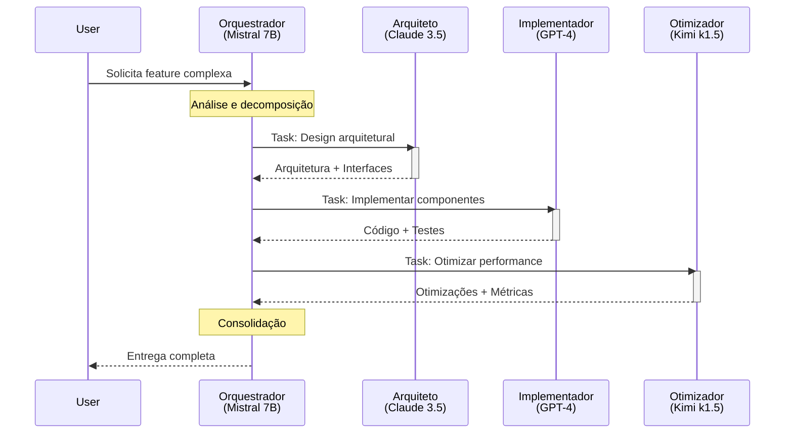

# Workflow de Execução - Subsagentes

## Diagrama de Sequência Completo



## Protocolo de Comunicação

### 1. Formato de Mensagem

```typescript
interface AgentMessage {
  header: {
    message_id: string;
    timestamp: string;
    sender: 'orchestrator' | 'architect' | 'implementer' | 'optimizer';
    recipient: string;
    correlation_id?: string;
  };
  body: {
    type: 'task' | 'result' | 'query' | 'error';
    payload: TaskPayload | ResultPayload | QueryPayload | ErrorPayload;
  };
  metadata: {
    priority: 'low' | 'medium' | 'high' | 'critical';
    ttl?: number;
    tags: string[];
  };
}

interface TaskPayload {
  task_id: string;
  description: string;
  context: Record<string, any>;
  requirements: string[];
  deliverables: string[];
  acceptance_criteria: string[];
  deadline?: string;
}

interface ResultPayload {
  task_id: string;
  status: 'completed' | 'partial' | 'failed' | 'blocked';
  artifacts: Artifact[];
  metrics: {
    tokens_used: number;
    time_spent: number;
    quality_score: number;
  };
  next_steps?: string[];
  blockers?: string[];
}
```

### 2. Estados de Task

```
PENDING → ASSIGNED → IN_PROGRESS → REVIEW → COMPLETED
    ↓         ↓            ↓           ↓         ↓
  CANCELLED  FAILED      BLOCKED    REJECTED   ARCHIVED
```

### 3. Retry Policy

```typescript
const RETRY_CONFIG = {
  max_attempts: 3,
  backoff_strategy: 'exponential',
  initial_delay: 1000, // ms
  max_delay: 30000, // ms
  retryable_errors: [
    'TIMEOUT',
    'RATE_LIMIT',
    'TEMPORARY_ERROR'
  ]
};
```

## Exemplos de Workflows

### Workflow A: Nova Feature (Completo)

```
┌─────────────────────────────────────────────────────────────┐
│ FASE 1: ANÁLISE (Orquestrador - Mistral)                    │
├─────────────────────────────────────────────────────────────┤
│ Input: Solicitação do usuário                               │
│                                                              │
│ Processo:                                                   │
│ 1. Extrair requisitos                                       │
│ 2. Identificar dependências                                 │
│ 3. Decompor em subtarefas                                   │
│ 4. Selecionar agentes                                       │
│                                                              │
│ Output: Plano de execução                                   │
└──────────────────────────┬──────────────────────────────────┘
                           │
                           ▼
┌─────────────────────────────────────────────────────────────┐
│ FASE 2: ARQUITETURA (Arquiteto - Claude)                    │
├─────────────────────────────────────────────────────────────┤
│ Input: Plano de execução                                    │
│                                                              │
│ Processo:                                                   │
│ 1. Analisar requisitos                                      │
│ 2. Projetar arquitetura                                     │
│ 3. Definir interfaces                                       │
│ 4. Documentar decisões                                      │
│                                                              │
│ Output: Design + ADRs + Diagramas                           │
└──────────────────────────┬──────────────────────────────────┘
                           │
                           ▼
┌─────────────────────────────────────────────────────────────┐
│ FASE 3: IMPLEMENTAÇÃO (Implementador - GPT-4)               │
├─────────────────────────────────────────────────────────────┤
│ Input: Design arquitetural                                  │
│                                                              │
│ Processo:                                                   │
│ 1. Implementar componentes                                  │
│ 2. Escrever testes                                          │
│ 3. Documentar código                                        │
│ 4. Verificar integração                                     │
│                                                              │
│ Output: Código + Testes + Docs                              │
└──────────────────────────┬──────────────────────────────────┘
                           │
                           ▼
┌─────────────────────────────────────────────────────────────┐
│ FASE 4: OTIMIZAÇÃO (Otimizador - Kimi)                      │
├─────────────────────────────────────────────────────────────┤
│ Input: Código implementado                                  │
│                                                              │
│ Processo:                                                   │
│ 1. Analisar performance                                     │
│ 2. Identificar gargalos                                     │
│ 3. Aplicar otimizações                                      │
│ 4. Medir melhorias                                          │
│                                                              │
│ Output: Código otimizado + Benchmarks                       │
└──────────────────────────┬──────────────────────────────────┘
                           │
                           ▼
┌─────────────────────────────────────────────────────────────┐
│ FASE 5: CONSOLIDAÇÃO (Orquestrador - Mistral)               │
├─────────────────────────────────────────────────────────────┤
│ Input: Resultados de todos os agentes                       │
│                                                              │
│ Processo:                                                   │
│ 1. Validar completude                                       │
│ 2. Verificar consistência                                   │
│ 3. Consolidar entregáveis                                   │
│ 4. Preparar resumo                                          │
│                                                              │
│ Output: Entrega final ao usuário                            │
└─────────────────────────────────────────────────────────────┘
```

### Workflow B: Bug Fix (Rápido)

```
Usuário reporta bug
        │
        ▼
Orquestrador (Mistral)
├── Classifica: Bug crítico
├── Seleciona: Implementador
└── Delega imediatamente
        │
        ▼
Implementador (GPT-4)
├── Analisa código
├── Identifica causa raiz
├── Implementa fix
└── Escreve teste regressão
        │
        ▼
Otimizador (Kimi) - OPCIONAL
├── Verifica se há impacto performance
├── Otimiza se necessário
└── Valida fix
        │
        ▼
Orquestrador (Mistral)
├── Consolida
└── Entrega ao usuário
```

### Workflow C: Otimização (Específico)

```
Usuário: "Sistema está lento"
        │
        ▼
Orquestrador (Mistral)
├── Analisa: Performance issue
└── Seleciona: Otimizador
        │
        ▼
Otimizador (Kimi)
├── Coleta métricas
├── Identifica gargalos
├── Propõe otimizações
└── Estima ganhos
        │
        ▼
Implementador (GPT-4)
├── Implementa otimizações aprovadas
├── Mantém funcionalidade
└── Adiciona testes
        │
        ▼
Orquestrador (Mistral)
├── Valida resultados
└── Reporta melhorias
```

## Custo por Workflow

| Workflow | Orquestrador | Arquiteto | Implementador | Otimizador | **Total** |
|----------|--------------|-----------|---------------|------------|-----------|
| **Nova Feature** | $0.001 | $0.015 | $0.08 | $0.015 | **$0.11** |
| **Bug Fix** | $0.0005 | - | $0.03 | $0.005 | **$0.035** |
| **Refatoração** | $0.0008 | $0.01 | $0.05 | $0.02 | **$0.08** |
| **Otimização** | $0.0005 | - | $0.02 | $0.03 | **$0.05** |

## Monitoramento

### Métricas por Workflow

```typescript
interface WorkflowMetrics {
  workflow_id: string;
  type: string;
  start_time: Date;
  end_time: Date;
  duration_ms: number;
  
  agents_involved: Array<{
    agent_id: string;
    model: string;
    tokens_used: number;
    cost: number;
    duration_ms: number;
  }>;
  
  total_cost: number;
  total_tokens: number;
  success: boolean;
  quality_score: number;
}
```

### Alertas

```typescript
const ALERTS = {
  high_cost: {
    condition: (m) => m.total_cost > 0.50,
    message: 'Workflow custando mais que $0.50'
  },
  
  long_duration: {
    condition: (m) => m.duration_ms > 120000,
    message: 'Workflow demorando mais que 2 minutos'
  },
  
  low_quality: {
    condition: (m) => m.quality_score < 0.7,
    message: 'Qualidade abaixo de 70%'
  },
  
  agent_failure: {
    condition: (m) => !m.success,
    message: 'Workflow falhou'
  }
};
```

## Fallbacks

### Quando um agente falha:

1. **Retry**: Tentar novamente (até 3x)
2. **Escalar**: Usar modelo maior do mesmo provider
3. **Degradar**: Simplificar task e tentar novamente
4. **Bypass**: Pular etapa se não for crítica
5. **Human**: Escalar para intervenção humana

### Fallback Chain:

```
Agent Failure
      │
      ├── Retry (3x)
      │     └── Success? → Continue
      │
      ├── Escalar modelo
      │     └── Claude 3.5 → Claude 3 Opus
      │     └── GPT-4 → GPT-4 Turbo
      │     └── Kimi → GPT-4
      │
      ├── Simplificar task
      │     └── Dividir em tasks menores
      │
      └── Human escalation
```

## Checklist de Qualidade

### Antes de Delegar:

- [ ] Task está clara e específica?
- [ ] Contexto está completo?
- [ ] Critérios de aceitação definidos?
- [ ] Agente correto selecionado?
- [ ] Dependências identificadas?

### Após Receber Resultado:

- [ ] Todos os entregáveis presentes?
- [ ] Qualidade atende critérios?
- [ ] Testes passando?
- [ ] Documentação completa?
- [ ] Métricas coletadas?

## Próximos Passos

1. Implementar sistema de filas
2. Criar dashboard de monitoramento
3. Configurar alertas
4. Testar workflows end-to-end
5. Documentar casos de uso
